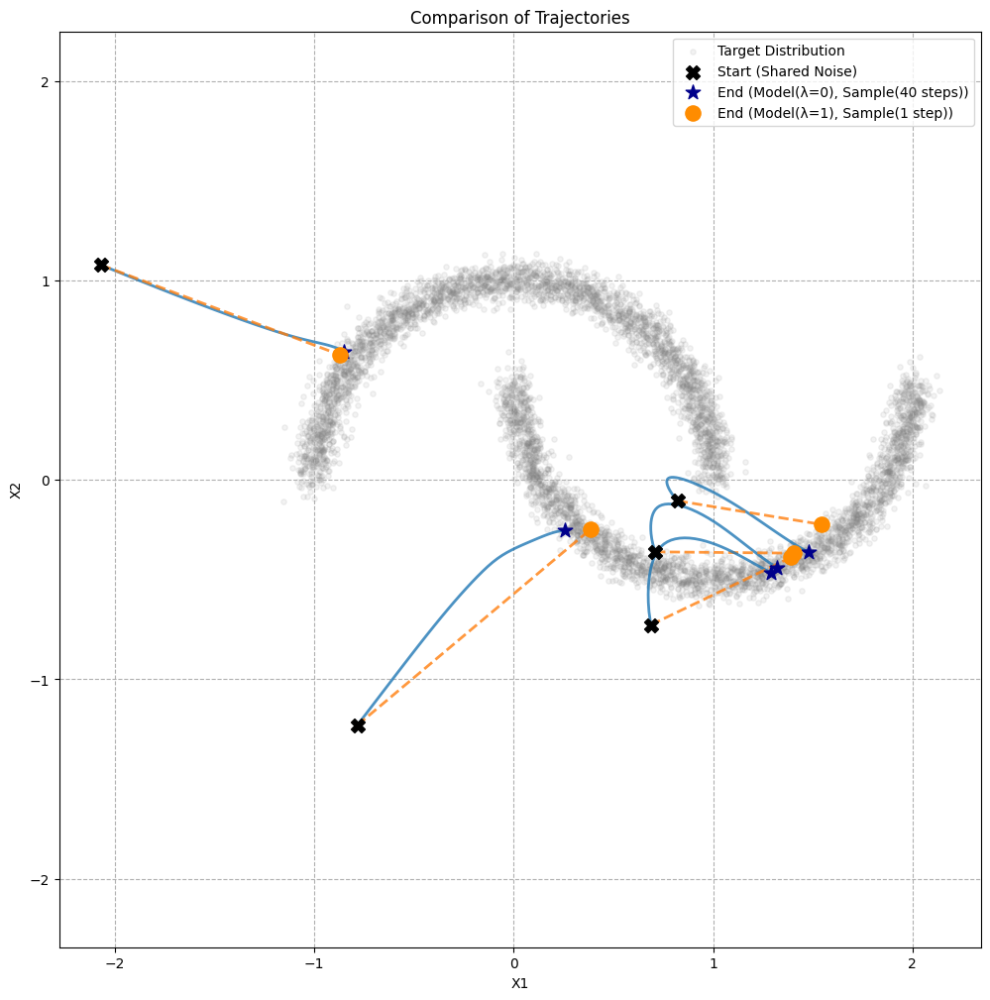

# UCGM on 2 Moons

This repository provides a minimal implementation of [UCGM](https://github.com/LINs-lab/UCGM) (Unified Continuous Generative Models) on the toy [2 Moons](https://scikit-learn.org/stable/modules/generated/sklearn.datasets.make_moons.html) dataset. 

It is designed as an **easy-to-run demo** for quick experimentation and learning.

## 📊 Example Result

The figure below compares sampling trajectories starting from the **same initial noise points**:

- **Blue curves**: multi-step sampling with a flow-matching model (λ=0, 40 steps)  
- **Orange dashed lines**: one-step sampling with a consistency model (λ=1, 1 step)  

<p align="center">
  
</p>


## 🚀 Usage

After installing requirements:

```
pip install -r requirements.txt
```

You can run the Python script:

```
python ucgm_on_2moons.py
```

Or open the Jupyter notebook `UCGM_on_2moons.ipynb` for step-by-step execution and visualization.


## 🛠️ Model configuration
- `λ = 0` → Flow Matching (multi-step sampling)  
- `0 < λ < 1` → Diffusion models (multi-step sampling)  
- `λ = 1` → Consistency model (**one-step sampling only**)  

Both `λ` and the number of sampling steps are controlled in the `Config` class. For example:

```python
config1 = Config(lam=0.0, sampling_steps=40)
```

- `lam` sets which model is used.  
- `sampling_steps` controls how many steps are used in sampling (ignored when `lam=1`, since the consistency model only supports one step).  


## 📄 Reference

- Original [UCGM](https://github.com/LINs-lab/UCGM) (Unified Continuous Generative Models)
- 2 Moons dataset: [sklearn.datasets.make_moons](https://scikit-learn.org/stable/modules/generated/sklearn.datasets.make_moons.html)
